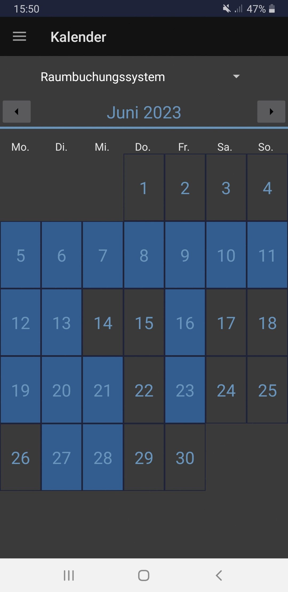

# Cars10ZES

  

    
Cars10ZES is a time tracking application. It should help to keep track of the time spent on private projects. There is a basic functionality to track the time of a work session including one or multiple pauses. The times are stored in a local database. One goal of this project is to keep it easy to use and not keep you from your work.

  

  

    
  

## Installation

Download and install the latest Android package [here](https://github.com/MMaue/Cars10ZES/releases/download/v0.2.3/Cars10ZES_0.2.3.apk).

## Usage

To start a work session, you need to tap the start button, after which the app can be closed. There are no services running in the background and energy consumption remains low. When you want to start a pause, just open the app and tap the Start-Pause button. The app can be closed at any time without data loss. When the session ends by pressing the end button, only the time you actually spend working on your project is shown.

## Features

- [x] tracking time
- [x] storing work sessions in a local database
- [x] history view showing all of the projects you worked on
- [x] calendar view
- [x] overview page
  - [x] average, min and max time of one session
  - [x] overall time spend on a project
- [ ] graph view of the start and end times
- [ ] manual addition, modification, deletion of entries
